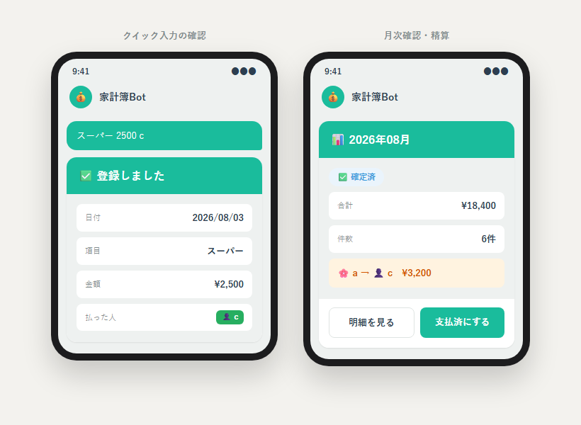

# kakeibo-bot

<!-- リポジトリ作成後、YOUR_GITHUB_USERNAME を実際のGitHubユーザー名に置き換えてください -->


LINEのトーク上でテキスト入力・ボタン操作するだけで記帳できる、2人で使う割り勘家計簿LINE Bot。Node.js（Express）＋ SQLite ＋ Google Sheets API（人間可読なミラー）＋ LINE Messaging APIで実装し、Raspberry Pi上でsystemdサービスとして常時稼働している本番システムです。

もとは Google Apps Script（GAS）版として作り始め、機能パリティを達成した段階でNode.js版に全面移行しました。



*実際のFlex Message構造（`src/flexBuilders.js`）を再現したモックアップです（`docs/demo.html`）。*

## 主な機能

- **クイック入力**: `スーパー 2500 c` のようにテキスト1行で即登録（日付・語順は不問、全角/半角、`1.5k`のような単位表記にも対応）
- **ステップ入力**: ボタンで日付→題目→金額→払った人を順に入力する対話フロー
- **月次確認**: 「確認」で即座に今月のデータを表示（合計・精算額のサマリーを先に表示）。他の月へも遷移可能
- **編集・削除**: 月→行→項目を選んで既存データを修正・削除
- **支払いステータス管理**: `確定前→確定済→支払済`の3段階。確定後はLINEからの追加・編集・削除をロックし、誤操作を防止
- **読み取り専用GraphQL API**: LINE Bot本体とは別プロセスで動く、家計簿データ参照用のGraphQL API（後述）。将来のフロントエンドSPAの土台
- **月初めリマインド**: 未精算の月をまとめて通知（cron実行、通知先の切り替えはデバッグフラグで対応）
- **スプレッドシートとの双方向同期**: Bot側の操作はスプレッドシートへ非同期ミラー、スプレッドシート側の直接編集もWebhook経由でDBへ反映
- **オフサイトバックアップ**: DB・スプレッドシートの両方を週次でバックアップし、任意でGoogle Driveへもアップロード

## 技術スタック

- Node.js / Express
- TypeScript（JSDoc + `checkJs`による段階的型付け、主要モジュールから適用）
- jsdoc — JSDocコメントからのHTML仕様書自動生成
- GraphQL（`@apollo/server`）— 読み取り専用API
- SQLite（`better-sqlite3`）— 主データストア
- Google Sheets API — 人間が直接編集できるミラーとして双方向同期
- Google Apps Script（`onEdit`インストール型トリガー）— スプレッドシート側の変更検知
- Google Drive API（OAuth委任）— バックアップのオフサイト保存
- LINE Messaging API（`@line/bot-sdk`）
- `node:test`（標準テストランナー、外部依存なし）＋ `supertest`（`server.js`のHTTP統合テスト）

## アーキテクチャ / 設計上の工夫

このプロジェクトの一番の見どころは、**運用しながら「スプレッドシート直叩き」から「SQLite主体＋双方向ミラー同期」へ段階的に移行した過程**です。

- **なぜSQLiteに移行したか**: 当初はスプレッドシートを唯一のデータソースとして都度APIを呼ぶ設計でしたが、応答速度がSheets/LINE APIへのネットワーク往復に律速されていました。ローカルのSQLiteを主データストアにすることで応答速度を改善しつつ、スプレッドシートは「人間が使い慣れた画面で直接編集できるミラー」として残す方針にしました。
- **双方向同期の設計**:
  - Bot操作 → DBへ即時反映（LINE返信はこの完了を待つ）→ スプレッドシートへは非同期・fire-and-forgetでミラー
  - スプレッドシート直接編集 → Apps Scriptのインストール型`onEdit`トリガーが共有シークレット付きでWebhookへ通知 → DBへ反映
  - 行の同一性は物理行番号ではなくID列で判定するため、スプレッドシート上で行を挿入してもID対応が崩れない設計
- **ソフトデリート**: 金銭データを扱うため、削除は論理削除（`deleted_at`）のみ。IDも欠番のまま採番し、過去の参照が別データを指してしまう事故を防止
- **APIクォータ対策**: 月ごとに個別リクエストする実装ではGoogle Sheets APIの分間クォータにすぐ抵触したため、`batchGet`/`batchUpdate`でまとめてリクエストする方式に変更。加えて、支払済が確定した月はローカルにキャッシュして以後のAPI呼び出し対象から除外し、リクエスト数自体を削減
- **`@line/bot-sdk`のモック不可問題への対応**: SDKがESM/CJSデュアルパッケージ構成のため`node:test`の`mock.module()`で正しくモックできない問題に対し、実際の送信関数を引数として渡す設計に切り出してテスト可能にした（カレンダーBotと共通の設計判断）
- **失敗の可視化**: バックアップ処理は「全体失敗」「スプレッドシート出力のみ失敗」「Driveアップロードのみ失敗」を区別してLINEへ通知し、サイレントに失敗し続けることを防止
- **画面/フロー単位でのファイル分割**: `flexBuilders.js`（Flex Message構築）・`webhookHandler.js`（イベントルーティング）はいずれも肥大化していたため、`flex/`・`webhook/`配下へ画面/フロー単位で分割した。公開APIは変更していないため呼び出し側・テストへの影響はゼロ。分割後もあえて`flexBuilders.js`/`webhookHandler.js`自体は薄いバレルファイルとして残し、ディレクトリ化はしていない — `tests/server.test.js`が`mock.module('../src/webhookHandler.js', ...)`のように拡張子込みの文字列でモック対象を指定しており、同名ディレクトリではなくファイルとして存在している必要があるため

## 読み取り専用GraphQL API

家計簿データ（明細・月次統計・精算・支払いステータス）を参照するための、LINE Bot本体（`server.js`）とは別プロセス・別ポートで動くGraphQL API（`src/graphqlServer.js`）です。

- **書き込みロジックには一切触れない**: LINE Webhookの追加・編集・削除・ロック判定とはコードパスを完全に分離。既存のSQLite（`dbService.js`）を読むだけ
- **依存性注入でテスト容易性を確保**: リゾルバーは`dbService`のシングルトンを直接requireせず、Apollo Serverの`context`経由で受け取る設計にした。これにより本番はシングルトンを、テストは`createDbService(':memory:')`の使い捨てインスタンスを注入でき、HTTPを一切立てずに`server.executeOperation()`で検証できる
- **既存ロジックの再利用**: 統計・精算計算はBot本体の`utils.calcMonthlyStats`/`calcSettlement`をそのまま再利用（Sheets時代からの行タプル形式への変換のみGraphQL側で行う）

```graphql
type Query {
  months: [String!]!
  monthSummary(ym: String!): MonthSummary!
}
```

`npm run graphql`で起動（既定ポート4000、`.env`の`GRAPHQL_PORT`で変更可）。将来のフロントエンドSPA（React/Next.js等での管理画面）を作る際の土台という位置づけです。

## フォルダ構成

```
.
├── package.json
├── .env.example
├── src/
│   ├── config.js               # 環境変数の読み込み・定数
│   ├── server.js               # Expressエントリポイント（/webhook, /sheets-sync, /health）
│   ├── graphqlServer.js        # 読み取り専用GraphQL APIのエントリポイント（別プロセス・別ポート）
│   ├── graphql/
│   │   ├── typeDefs.js         # GraphQLスキーマ定義
│   │   └── resolvers.js        # リゾルバー（dbServiceはcontext経由で注入）
│   ├── dbService.js            # 主データストア（SQLite、better-sqlite3）
│   ├── sheetsService.js        # Google Sheets API操作
│   ├── sheetsMirrorService.js  # DB→Sheetsの非同期ミラー同期
│   ├── sheetsSyncHandler.js    # Sheets→DBの逆方向同期（/sheets-syncハンドラ）
│   ├── migrateSheetsToDb.js    # 初回移行用の一括移行スクリプト
│   ├── quickInput.js           # クイック入力パーサー
│   ├── flexBuilders.js         # LINE Flex Message構築（画面単位でflex/へ分割、公開APIをまとめるバレル）
│   ├── flex/
│   │   ├── core.js             # buildFlexMessage/buildToast/buildEmpty等の共通ヘルパー
│   │   ├── menu.js             # アイドルメニュー
│   │   ├── addFlow.js          # 追加フロー
│   │   ├── monthFlow.js        # ステータス変更・月選択・月次一覧・サマリー
│   │   ├── editFlow.js         # 編集フロー
│   │   ├── deleteFlow.js       # 削除フロー
│   │   ├── guide.js            # クイック入力ガイド
│   │   └── reminder.js         # 月初リマインドのカルーセル
│   ├── lineService.js          # LINE APIクライアント・署名検証middleware
│   ├── webhookHandler.js       # イベント受付・エラーハンドリング（フロー単位でwebhook/へ分割、バレル）
│   ├── webhook/
│   │   ├── postbackRouter.js   # Postbackルーティング・ステップハンドラーテーブル
│   │   ├── messageRouter.js    # テキストメッセージのキーワードルーティング
│   │   ├── addFlow.js          # 追加フローのステップハンドラー
│   │   ├── monthFlow.js        # 月選択・handleShowMonth
│   │   ├── deleteFlow.js       # 削除フローのステップハンドラー
│   │   ├── editFlow.js         # 編集フローのステップハンドラー・saveEdit
│   │   └── settlementNotify.js # 精算完了通知
│   ├── state.js                # 会話状態管理（メモリ内Map）
│   ├── errors.js                # カスタムエラークラス
│   ├── utils.js                 # 日付/金額フォーマット・精算計算
│   ├── reminder.js              # 未精算月のリマインド（cron実行）
│   ├── reminderStore.js         # リマインド確認済み月の永続化
│   ├── backup.js                # DB・スプレッドシートのバックアップ（cron実行）
│   ├── maintenanceSortSheets.js # スプレッドシートの行順メンテナンス（cron実行）
│   └── checkLineQuota.js        # LINE無料メッセージ枠の週次通知
├── scripts/
│   └── get_drive_token.js       # Google Drive用OAuthリフレッシュトークンの取得スクリプト
├── tests/                       # node:testによるユニットテスト
└── deploy/
    ├── kakeibo-bot.service      # systemdユニットファイル
    ├── health_monitor.sh        # ヘルスチェック監視スクリプト（cron実行）
    └── deploy_kakeibo.ps1       # デプロイスクリプト（PC→サーバー、scp+ssh）
```

## データモデル（SQLite）

```sql
CREATE TABLE entries (
  id INTEGER PRIMARY KEY AUTOINCREMENT,
  ym TEXT NOT NULL,               -- 'yyyy-MM'
  date TEXT NOT NULL,             -- 'yyyy-MM-dd'
  subject TEXT NOT NULL,
  price INTEGER NOT NULL,
  payer TEXT NOT NULL CHECK (payer IN ('c','a')),
  created_at TEXT NOT NULL, updated_at TEXT NOT NULL,
  deleted_at TEXT NULL            -- ソフトデリート
);
CREATE TABLE month_status (ym TEXT PRIMARY KEY, status TEXT NOT NULL DEFAULT '', updated_at TEXT NOT NULL);
CREATE TABLE users (user_id TEXT PRIMARY KEY, last_used_at TEXT NOT NULL, use_count INTEGER NOT NULL DEFAULT 0);
```

## セットアップ

1. LINE Developersでチャネルを作成し、アクセストークン・チャネルシークレットを取得
2. GCPプロジェクトでサービスアカウントを作成し、Sheets APIを有効化。JSONキーを`credentials/service-account.json`に配置
3. 対象のスプレッドシートをサービスアカウントに編集者として共有
4. `.env.example`を`.env`にコピーし、各値を設定（Google Driveバックアップを使う場合は`scripts/get_drive_token.js`でOAuthリフレッシュトークンを取得）
5. `npm install`
6. `npm test` でユニットテストを実行（本番データには一切アクセスしない設計）
7. `node src/server.js` でローカル起動、または`deploy/`のsystemdユニットファイルを参考にサーバーへ配置

## 仕様書自動生成

日本の受託開発では仕様書が納品物として求められることが多いため、コードから仕様書までJSDocコメントを起点に機械的に生成できることを示すデモです。

```
npm run docs  # docs/api/ にHTML仕様書を生成（jsdoc）
```

対象は現時点でJSDoc型注釈を整備済みの`dbService.js`・`flexBuilders.js`の2ファイル（主データ層・Flex Message構築層）。関数ごとの`@param`/`@returns`/`@typedef`がそのまま仕様書の項目として出力されます。生成物はビルド成果物のため`.gitignore`対象（コミットせず`npm run docs`で再生成する運用）、CIでも生成が壊れていないかを確認しています。

## テスト・静的解析

```
npm test              # ユニットテスト
npm run test:coverage # カバレッジ計測付き
npm run lint          # ESLint
npm run typecheck     # TypeScript（JSDoc型注釈によるcheckJs）
```

`node:test`を使用。`dbService.js`は`better-sqlite3`の`:memory:`DBに対して直接テストし、外部APIに依存する層（`sheetsService.js`/`lineService.js`）は`mock.module()`でモック。テストは本番データを含むDBファイルに一切アクセスしない設計を徹底しています。

`webhookHandler.js`等のロジックはユニットテスト（内部モジュールをモックして関数単位で検証）でカバーする一方、`server.js`（Expressエントリポイント）だけはsupertestによる**HTTP統合テスト**（`tests/server.test.js`）にしています。実際にHTTPリクエストを送り、LINEの署名検証・ルーティング・`/sheets-sync`の認証まで実装のまま通しで検証する点がユニットテストと異なります。この統合テストの追加により、**不正/欠落した署名が401ではなく500として処理されてしまうバグ**（署名検証エラーにstatusCodeが無く、エラーハンドラー未設置のままExpressの既定の500ハンドラーに落ちていた）を発見し修正しました。

- テスト: 118件 pass（HTTP統合テスト11件・GraphQL APIテスト4件を含む）
- カバレッジ（行）: 全体80.30%。`config.js`/`dbService.js`/`errors.js`/`lineService.js`/`quickInput.js`/`reminderStore.js`/`server.js`/`sheetsSyncHandler.js`/`state.js`/`utils.js`/`graphqlServer.js`/`graphql/*.js`は100%
- カバレッジ（分岐）: 全体88.39%。実際に起こりうる分岐（日付の年ロールオーバー、通知メッセージ生成失敗時のフォールバック、ローカル設定ファイルが壊れていた場合の復帰等）は個別に追加テスト済み。一方、呼び出し経路上ほぼ発生しない防御的なフォールバック（`||`のデフォルト値、想定外の列名・支払者値など）はテストを書いても実質的な検証価値が低いため見送り、Flex Message構築（`flexBuilders.js`）・状態遷移の一部分岐（`webhookHandler.js`）も分岐数が多く価値対効果が低いため未着手（2026-07-25判断）
- ESLint: 0 errors
- `server.js`の`require.main === module`ブロック（本番実行時のみ通る起動処理）はテストプロセス内では検証できないため`/* node:coverage ignore next */`で明示的に対象外にしている
- 型チェック: TypeScript（`tsc --checkJs`）でエラー0件。ファイルはリネームせず、JSDocの`@param`/`@returns`/`@typedef`でJavaScriptに型を付与する段階的導入方式（既存の実行時コードに手を加えず型安全性を追加できるため）。主データ層（`dbService.js`）とFlex Message構築層（`flexBuilders.js`）から適用済み。他モジュールは`// @ts-nocheck`で対象外にしたまま、価値の高い順に個別解除していく方針

※`better-sqlite3`はネイティブモジュールのため、`npm install`にはC++ビルドツール（Windowsの場合はVisual Studio Build Tools、Linux/Macの場合はビルド用のヘッダ類）が必要です。
